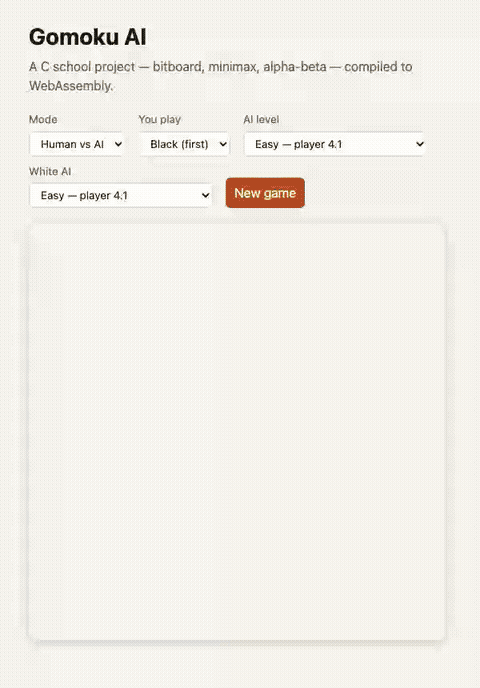
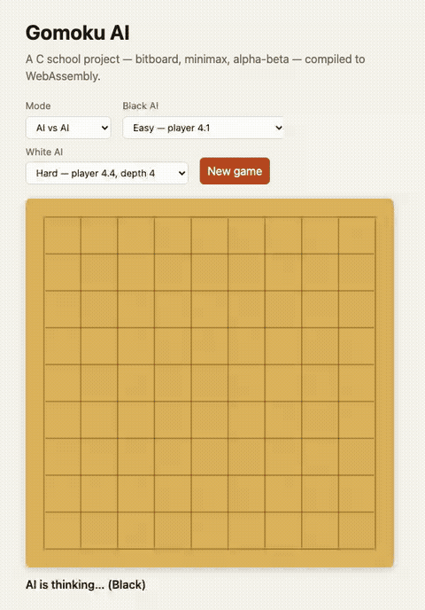
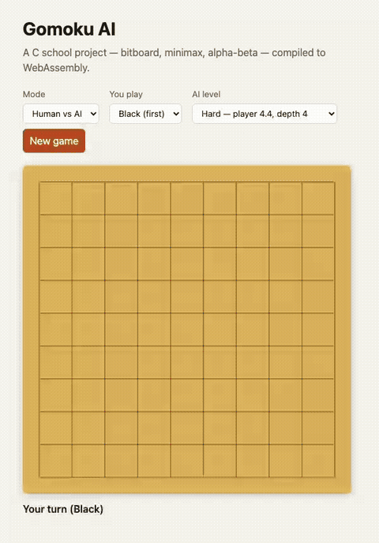

# Gomoku AI

Play Gomoku against a minimax AI written in C, compiled to WebAssembly and running in your browser.

**[▶ Play online](https://laurentgenty.github.io/gomoku-AI/)**



| AI vs AI — player 4.1 vs player 4.4 | The AI thinking |
|---|---|
|  |  |

## How it works

- **Bitboard.** Each player's stones live in one 128-bit integer, one bit per cell (hence boards up to 11×11). Wins and full boards are checked with a few bitwise operations.
- **Negamax with alpha-beta pruning.** The AI explores a few moves ahead, assuming the opponent always plays their best answer, and skips branches that cannot change its choice.
- **Crossing-lines heuristic.** Each empty cell is scored from 0 to 13 from the lines it would create (open four, double open three…). Crossings score highest because they win games. Only the best-scored cells are searched, which keeps the tree small.
- **In the browser.** The C code is compiled with Emscripten into three WebAssembly modules: a referee (the rules) and two AI players. Each AI runs in its own Web Worker, so the page never freezes. TypeScript only draws the board and passes moves around.

On the hard level the AI answers in at most **1,300 ms** per move (Chromium, Apple Silicon Mac).

Full write-up, in French: [project report](doc/rapport.pdf).

## Levels

| Level | Player | Heuristic | Search depth |
|---|---|---|---|
| Easy | 4.1 | alignments only | 2 |
| Medium | 4.4 | crossing lines | 2 |
| Hard | 4.4 | crossing lines | 4 |

## Build

Native (C99, gcc or clang):

```bash
make test       # unit tests, 4.4 vs random, threaded vs sequential 4.4
make players    # the players as shared libraries
make valgrind   # memory checks (Linux)
make doc        # Doxygen documentation
```

WebAssembly and web app (Emscripten, Node 22):

```bash
make wasm
cd web
npm ci
npm run dev     # local server
npm test        # unit + WebAssembly tests
npm run e2e     # browser smoke test
npm run record  # re-record the GIFs in docs/media
```

## Repository layout

| Path | Content |
|---|---|
| `src/server/` | Bitboard and move queue (rebuilt, see below) |
| `src/players/` | The AI players and heuristics |
| `src/wasm/` | Thin Emscripten adapters |
| `src/test/` | C tests |
| `web/` | Vite + TypeScript front end |
| `doc/` | Report (LaTeX/PDF) and Doxygen configuration |

## About the rebuilt server code

The `src/server/` sources were missing from the repository. The bitboard was rebuilt from the project report, the existing tests and the way the players call it. `board__explore_line`, the pattern detection behind the 4.x heuristics, was rewritten and checked against the expectations of `src/test/test_player.c`. The `dlopen`-based game server was not rebuilt: the web app plays its role.

## Credits

Emeric Duchemin, Laurent Genty, Julien Miens and Tanguy Pemeja. Special thanks to F. Herbreteau.
